<p align="right"><sub><b>Português</b> · <a href="./README.en.md">English</a></sub></p>

<p align="center">
<picture>
  <source media="(prefers-color-scheme: dark)" srcset="./assets/hero-dark.svg" />
  <source media="(prefers-color-scheme: light)" srcset="./assets/hero-light.svg" />
  
</picture>
</p>

<p align="center">
  <b>Software que percebe o mundo físico — do sensor à rede neural.</b><br />
  <sub>Engenharia de Software @ UnB · Brasília · IA · Visão Computacional · Sistemas Embarcados</sub>
</p>

<p align="center">
  <a href="https://matheus-lemes.matheuslemesam.chatgpt.site">Portfólio</a> &nbsp;·&nbsp;
  <a href="https://github.com/1emes?tab=repositories">Repositórios</a> &nbsp;·&nbsp;
  <a href="https://www.linkedin.com/in/matheus-lemes-amaral-877a71309/">LinkedIn</a> &nbsp;·&nbsp;
  <a href="mailto:matheuslemesam@gmail.com">E-mail</a>
</p>

## Olá! 👋

Sou o **Matheus**, estudante de Engenharia de Software na **Universidade de Brasília (UnB)**. Gosto de software que sai da tela e encosta no mundo real: câmeras, sensores, satélites e os modelos que dão sentido aos dados que eles geram.

- 🧠 Meu foco hoje é **inteligência artificial** — em especial **deep learning** e **visão computacional**.
- 🛰️ Fui integrante da **Gama CubeDesign**, onde participei da missão **GamaSat-01**.
- ⚙️ Trabalho com **sistemas embarcados e telemetria** para missões de alta altitude.
- 🌐 Quando uma ideia precisa de interface, construo com **TypeScript, React e Node**.

## 🛰️ Missão GamaSat-01

<table>
<tr>
<td>

Na **Gama CubeDesign**, equipe de CubeSat da UnB, participei da missão **GamaSat-01** para a competição **CubeDesign 2025**, trabalhando no **sensoriamento remoto** da carga útil.

O objetivo: a partir das imagens capturadas pelo satélite, **detectar manchas de óleo no mar** e **identificar a embarcação responsável**, cruzando a posição da mancha com os dados **AIS** dos navios na região.

```text
câmera ─▶ máscara HSV ─▶ contorno + área ─▶ grade da missão ─▶ cruzamento AIS ─▶ MMSI do poluidor ─▶ JSON
```

- Segmentação da mancha no espaço de cor **HSV** com **OpenCV** (limiarização, morfologia e contornos)
- Cálculo e estabilização da **área da mancha** ao longo dos frames
- Conversão de pixels para o **sistema de coordenadas da missão**
- Detecção de embarcações com **transformada de Hough**
- Identificação do poluidor pela **menor distância** entre navio (AIS) e contorno da mancha, com saída em **JSON**

<sub><samp>C++ · OpenCV · AIS</samp></sub> &nbsp;→&nbsp; **[Sensoriamento-CubeDesign2025](https://github.com/1emes/Sensoriamento-CubeDesign2025)**

</td>
</tr>
</table>

## 🔭 Trajetória

| | Onde | O quê |
|:-:|---|---|
| 🎈 | **Laboratório Céu Aberto** | Sistemas embarcados, telemetria e rastreamento para missões de alta altitude |
| 🛰️ | **Gama CubeDesign** <sub>· ex-integrante</sub> | Missão GamaSat-01 — sensoriamento remoto e processo trainee de eletrônica |
| 🔭 | **LaSE · Sapiens-1** | Projeto do Laboratório de Sistemas Espaciais da UnB |

<p align="center">
<picture>
  <source media="(prefers-color-scheme: dark)" srcset="./assets/strata-divider-dark.svg" />
  <source media="(prefers-color-scheme: light)" srcset="./assets/strata-divider-light.svg" />
  
</picture>
</p>

## 🧪 Projetos

**[MRI-segmentation](https://github.com/1emes/MRI-segmentation)** &nbsp;<sub><samp>Python · visão computacional</samp></sub><br />
Detecção de tumores cerebrais em imagens de ressonância magnética.

**[Image-Captioning-DL](https://github.com/1emes/Image-Captioning-DL)** &nbsp;<sub><samp>PyTorch · encoder–decoder</samp></sub><br />
Encoder CNN combinado com decoders LSTM, GRU e Transformer, comparados lado a lado na geração automática de legendas.

**[ds18b20-Esp](https://github.com/1emes/ds18b20-Esp)** &nbsp;<sub><samp>C++ · ESP · IoT</samp></sub><br />
Sensor de temperatura DS18B20 em um microcontrolador ESP, com leituras servidas por um servidor web embarcado.

<details>
<summary><samp>Mais experimentos</samp></summary>
<br />

- **[Bird_Detection-DL](https://github.com/1emes/Bird_Detection-DL)** — Detecção de espécies de pássaros com redes convolucionais.
- **[IA2-CNN-FineTuning-GradCam](https://github.com/1emes/IA2-CNN-FineTuning-GradCam)** — Fine-tuning de CNN, explicado com Grad-CAM.
- **[EDA-2025.2](https://github.com/1emes/EDA-2025.2)** — Estruturas de dados em C (UnB).
- **[Crusty](https://github.com/1emes/Crusty)** — Compilador escrito em Rust — fork do projeto em equipe de Compiladores 1.

</details>

## 🧰 Stack

<table>
  <tr><td><samp>IA / ML</samp></td><td>    </td></tr>
  <tr><td><samp>Embarcados</samp></td><td>   </td></tr>
  <tr><td><samp>Web</samp></td><td>  </td></tr>
  <tr><td><samp>Linguagens</samp></td><td>  </td></tr>
  <tr><td><samp>Ferramentas</samp></td><td>    </td></tr>
  <tr><td><samp>Ambiente</samp></td><td>  </td></tr>
</table>

## 📡 Contato

Sempre aberto a conversar sobre **IA, visão computacional, sistemas embarcados e projetos espaciais**.

<p>
  <a href="https://matheus-lemes.matheuslemesam.chatgpt.site"></a>
  <a href="mailto:matheuslemesam@gmail.com"></a>
  <a href="https://www.linkedin.com/in/matheus-lemes-amaral-877a71309/"></a>
</p>

<p align="center"><sub>Obrigado pela visita! ✦</sub></p>
