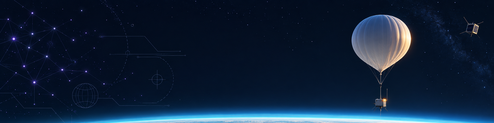
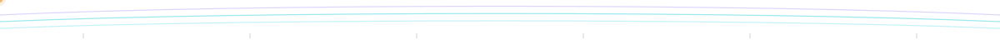
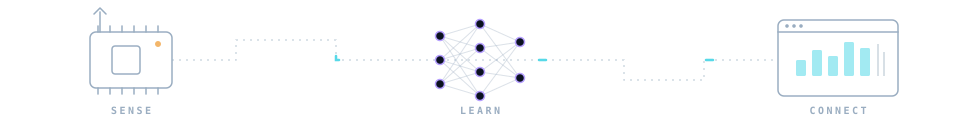

<b>English</b> · <a href="./README.pt-br.md">Português</a>

<picture>
  <source media="(prefers-color-scheme: dark)" srcset="./assets/hero-dark.png" />
  <source media="(prefers-color-scheme: light)" srcset="./assets/hero-light.png" />
  
</picture>

<h1 align="center">Matheus Lemes</h1>

  <b>Building systems that sense, learn, and connect.</b> 
  Software Engineering @ UnB · Brasília, Brazil · AI · Embedded · Fullstack

  <a href="https://matheus-lemes.matheuslemesam.chatgpt.site">Portfolio</a> &nbsp;·&nbsp;
  <a href="https://github.com/1emes?tab=repositories">Projects</a> &nbsp;·&nbsp;
  <a href="https://www.linkedin.com/in/matheus-lemes-amaral-877a71309/">LinkedIn</a>

### 01 · About

I'm a Software Engineering student at the **University of Brasília (UnB/FCTE)** who likes software best when it touches the physical world.

My current focus is **artificial intelligence**, especially **deep learning and computer vision**. I also work with **embedded systems and telemetry**, and I build fullstack apps with TypeScript, React and Node when an idea needs an interface.

### 02 · Labs & Teams

- 🔬 **Laboratório Céu Aberto** — Embedded systems, telemetry and mission tracking for high-altitude missions.
- 🛰️ **GamaCube Design** — CubeSat team at UnB/FCTE: electronics trainee program and remote sensing work.
- 🔭 **LaSE · Sapiens-1** — Project of UnB's Space Systems Laboratory (Laboratório de Sistemas Espaciais).

<picture>
  <source media="(prefers-color-scheme: dark)" srcset="./assets/strata-divider-dark.svg" />
  <source media="(prefers-color-scheme: light)" srcset="./assets/strata-divider-light.svg" />
  
</picture>

### 03 · Featured Projects

**[MRI-segmentation](https://github.com/1emes/MRI-segmentation)** &nbsp;<samp>Python · computer vision</samp> 
Brain tumor detection in magnetic resonance images.

**[Image-Captioning-DL](https://github.com/1emes/Image-Captioning-DL)** &nbsp;<samp>PyTorch · encoder–decoder</samp> 
A CNN encoder paired with LSTM, GRU and Transformer decoders, compared head to head for automatic image captioning.

**[Sensoriamento-CubeDesign2025](https://github.com/1emes/Sensoriamento-CubeDesign2025)** &nbsp;<samp>C++ · OpenCV</samp> 
Vessel detection in remote sensing imagery, cross-checked against AIS data, for the GamaCube Design CubeSat team.

**[ds18b20-Esp](https://github.com/1emes/ds18b20-Esp)** &nbsp;<samp>C++ · ESP · IoT</samp> 
A DS18B20 temperature sensor on an ESP microcontroller, served through its own embedded web server.

<samp>More experiments</samp>

 

- **[Bird_Detection-DL](https://github.com/1emes/Bird_Detection-DL)** — Bird species detection with convolutional networks.
- **[IA2-CNN-FineTuning-GradCam](https://github.com/1emes/IA2-CNN-FineTuning-GradCam)** — CNN fine-tuning, explained with Grad-CAM.
- **[EDA-2025.2](https://github.com/1emes/EDA-2025.2)** — Data structures in C (UnB).
- **[Crusty](https://github.com/1emes/Crusty)** — A compiler written in Rust — fork of a team project for Compilers 1.

### 04 · Stack

<picture>
  <source media="(prefers-color-scheme: dark)" srcset="./assets/signal-path-dark.svg" />
  <source media="(prefers-color-scheme: light)" srcset="./assets/signal-path-light.svg" />
  
</picture>

<table>
  <tr><td><samp>AI / ML</samp></td><td>    </td></tr>
  <tr><td><samp>Embedded</samp></td><td>   </td></tr>
  <tr><td><samp>Web</samp></td><td>  </td></tr>
  <tr><td><samp>Languages</samp></td><td>  </td></tr>
  <tr><td><samp>Tools</samp></td><td>    </td></tr>
  <tr><td><samp>Environment</samp></td><td>  </td></tr>
</table>

### 05 · Contact

Always happy to talk about **AI, embedded systems and space projects**.

  
  
  

Thanks for stopping by! ✦

